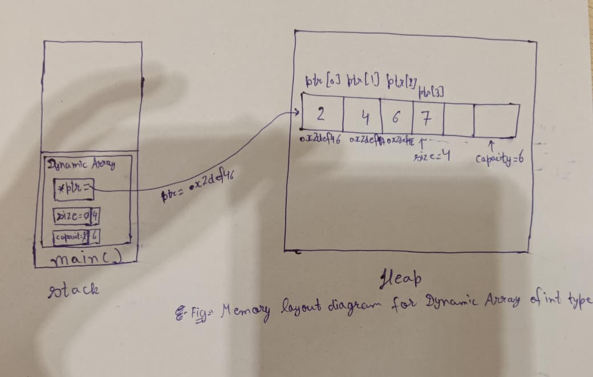

# Dynamic Array Design Proposal

This proposal describes the design & structure of the Dynamic Array. In this proposal there are total four sections. A Dynamic Array is a growable sequence container.

---

# Section-1: Public API

- In this section we are going to describe the basic or must functions or methods, methods structure like their name, parameter, their return types, etc.
- The purpose of this section (Public API) is to explain how our code will become resuable, simple and similar to modern data structures STL containers.

---

## `push_back(T ele)`

- This function performs the insertion of an element at the end of the array.
- If the array is full, we again allocate the bigger size array dynamically then copying the existing elements in it and then insert the new element at the end of the array.

**Parameter:**

- There is only one parameter which is passed by the calling function to insert that element at the end of the array.

**Return Type:**

- The return type of this function is `void` which means this function does not return any value.

---

## `pop_back()`

- This function removes the last element of the array.
- If the array is already empty then we have to throw some error or exception.

**Parameter:**

- There is no parameter, in this function we decrease the current size of the array and next time when needed a new element is overwrite in this memory space block. As after decresing the size of the array we lose the access to that address or memory block.

**Return Type:**

- The return type of this function is `void` which means this function does not return any value.

---

## `insertAtIndex(int index, T ele)`

- In this function we insert the element at the given index.
- First all the later elements from that index are shifted to right and then we insert the new element at the given index.
- If the array is full then we first allocate the bigger size array dynamically then copying the existing elements in it and then all the later elements from the given index are shifted to right and then we insert the new element at the given index.
- If the index is equal to the size of the array then we call the `push_back()` function and passed the element as a parameter to it.

**Parameter:**

- There are two parameter in this function which are passed by the calling function, one is the element value which has to be inserted and second is the index where we have to insert the new element.

**Return Type:**

- The return type of this function is `void` which means this function does not return any value.

---

## `deleteAtIndex(int index)`

- In this function the element is removed from the given index.
- In this function we left shift all the later elements after the given index.
- If the index is greater than the size of the array then we throw an exception.
- If the index is equal to the size of the then we call `pop_back()`.

**Parameter:**

- There is a only one parameter in this function which is passed by the calling function, it tells about the index from where the element has to be removed.

**Return Type:**

- The return type of this function is `void` which means this funciton does not return any value.

---

## `get(int index)`

- In this function we return the value stored at the given index.
- In this function we fetch the value from the array by indexing which means adding the index to the base address or base pointer.
- If the index is larger than the size of the array then we throw an exception.

**Parameter:**

- There is a only parameter in this function which is passed by the calling function, it tells about the index of which the element is to be returned.

**Return Type:**

- The reutrn type of this function is the type of the element which array stores it may be `int`, `float`, `string`, or may be some user-defined data type.

---

## `isEmpty()`

- In this function we return the true or false, whether the array is empty is empty or not.
- It can be used before deleting any element from the array so that we can prevent the program from the exceptions.
- In this function we check the size of the array, if the size of the array is `0` then we return false else retunr true.

**Parameter:**

- There is no parameter.

**Return Type:**

- The return type of this function is `boolean` either a `false (0)` or `true (1)`.

---

## `isFull()`

- In this function we return true or false, whether the array is full or not.
- In this function we check the size of the array, if the size of the array is equal to the capacity of the array then we return true else false.

**Parameter:**

- There is no parameter.

**Return Type:**

- The return type of this function is `boolean` either a `false (0)` or `true (1)`.

## `getSize()`
- This function simply returns the current size of the array by reading the value of the size variable of the Dynamic Array Data Structure.
**Parameter:**

- There is no parameter.

**Return Type:**

- The return type of this function is `int`.

**Function Structures:**
```cpp
template<typename T>
class DynamicArray{
    T* ptr;
    int size;
    int capacity;
public:
    DynamicArray(){
        size=0;
        capacity=1;
        ptr=(T*)malloc(sizeof(T)*capacity);
    }
    void push_back(T ele);
    void pop_back();
    void insertAtIndex(int idx, T ele);
    void deleteAtIndex(int idx);
    T get(int idx);
    bool isFull();
    bool isEmpty();
    int getSize();
}
```

---

# Section-2: Internal Representation

- A Dynamic Array internally maintains three essential data members:
  1. **Array Pointer (`arr`)** – Stores the base address of the dynamically allocated memory block. It points to the first element of the array.
  2. **Size (`size`)** – Represents the current number of elements stored in the array.
  3. **Capacity (`capacity`)** – Represents the maximum number of elements that the array can currently store without requiring reallocation.

- Both `size` and `capacity` are of type `int`.

- The array pointer (`arr`) is of type `T*`, where `T` is the type of elements stored in the Dynamic Array. It holds the address of the dynamically allocated memory block that stores elements of type `T`.

- Assuming a **64-bit system**, an `int` occupies **4 bytes** and a pointer occupies **8 bytes**. Therefore, the total memory required by these three data members is:

  ```text
  size      : 4 bytes
  capacity  : 4 bytes
  arr       : 8 bytes
  ----------------------
  Total     : 16 bytes
  ```


  >This calculation only represents the size of the object's data members.
- The internal representation defines how the Dynamic Array is implemented and managed in memory.
- 
- 

- The Dynamic Array is implemented using **Object-Oriented Programming (OOP)** principles.

- It is implemented as a **class** that encapsulates the three data members (`arr`, `size`, and `capacity`) along with the member functions described in **Section-1: Public API**.

- Since the class manages dynamically allocated memory, it follows the **Rule of Three**, which requires implementing the following special member functions:
  1. **Destructor**
  2. **Copy Constructor**
  3. **Copy Assignment Operator**

- **Destructor:**  
  The destructor is responsible for releasing all dynamically allocated memory owned by the object before the object is destroyed. This prevents memory leaks.

- **Copy Constructor:**  
  The copy constructor creates a new object as a copy of an existing object. Since the Dynamic Array owns dynamically allocated memory, the copy constructor must perform a **deep copy**, allocating a new memory block and copying all elements instead of simply copying the pointer.

- **Copy Assignment Operator:**  
  The copy assignment operator copies the contents of one existing Dynamic Array object into another existing object. It must perform a **deep copy**, properly release any previously allocated memory, handle self-assignment safely, and allocate new memory before copying the elements.

- By implementing the Rule of Three correctly, each Dynamic Array object owns its own independent memory, preventing issues such as:
  - **Shallow Copy**
  - **Double Deletion**
  - **Dangling Pointers**
  - **Memory Leaks**
---

# Section-3: Complexity Estimates

- In this section we estimate the time complexity of every public API provided by the Dynamic Array.
- The complexity of each operation is represented in three cases:
  - **Best Case:** 
  - **Average Case:** 
  - **Worst Case:** 

---

| Function | Best Case | Average Case | Worst Case | Explanation |
|----------|:---------:|:------------:|:----------:|-------------|
| `push_back(T ele)` | **O(1)** | **O(1) (Amortized)** | **O(n)** |<ul><li>Best Case: There is a sufficient capacity available so the element is directly inserted at the end of the array.</li><li>When the size is equal to capacity of the array, then a new array with larger capacity is allocated and all existing elements are copied to new array, the old memory is released and the new element is inserted at the end.</li><li> Since resizing occurs infrequently means the resizing occurs in order of(logn) terms and the simple insertion occurs in order of (n-logn) ,so the amortized complexity remains **O(1)**.</li> </ul>|
| `pop_back()` | **O(1)** | **O(1)** | **O(1)** | Removing the last element only decreases the current size of the array. No shifting of elements or memory reallocation is required, making the operation constant time in all cases. |
| `insertAtIndex(int index, T ele)` | **O(1)** | **O(n)** | **O(n)** |<ul><li>Best Case: when the insertion index is equal to the current size, the operation behaves like `push_back()` and takes constant time when resizing is not required.</li><li>Worst Case: When the insertion index is 0 or when resizing is required, we have to shift or copy all existing n elements.</li>|
| `deleteAtIndex(int index)` | **O(1)** | **O(n)** | **O(n)** |<ul><li> When deleting the last element, the operation behaves like `pop_back()` and only decreases the size.</li> <li>For deletion at any other position, all subsequent elements must be shifted one position to the left to maintain contiguous storage, resulting in linear time. </li></ul>|
| `get(int index)` | **O(1)** | **O(1)** | **O(1)** |The address of an element is calculated directly using the base address and index (`baseAddress + index`), eliminating the need for traversal. Therefore, element access always takes constant time. |
| `isEmpty()` | **O(1)** | **O(1)** | **O(1)** |The function simply compares the current size of the array with zero and returns the corresponding boolean value. |
| `isFull()` | **O(1)** | **O(1)** | **O(1)** |The function compares the current size with the current capacity of the array.|

---


### Complexity Analysis

- The Dynamic Array is designed to provide **constant-time random access** because all elements are stored in contiguous memory locations. 
- Operations performed at the end of the array, such as `push_back()` and `pop_back()`, are generally very efficient because they do not require shifting existing elements. 
- But insertion and deletion at arbitrary positions require shifting one or more elements to preserve contiguous storage, resulting in **O(n)** time complexity.

The automatic resizing strategy introduces an occasional **O(n)** cost when the array becomes full because every existing element must be copied into a newly allocated memory block. Despite this, the resizing operation occurs only after the capacity is exhausted, making the average cost of repeated insertions **O(1) amortized**. This resizing strategy significantly improves overall performance compared to increasing the capacity by one element after every insertion.

# Section-4: Design Decisions

1. **Initialization of Size and Capacity:**
   - The `size` is initialized to `0` because initially the Dynamic Array contains no elements.
   - The `capacity` is initialized to `1` instead of `0`. If both `size` and `capacity` were initialized to `0`, then the resizing condition (`size == capacity`) would be true, but doubling the capacity would still result in `0` (`0 × 2 = 0`). As a result, the array would never be able to allocate memory for new elements.
   - Therefore, initializing the capacity with `1` provides a valid starting point for the Dynamic Array. During insertion, the element is stored at index `size`, and then `size` is incremented (e.g., `arr[size++] = value`).

---

2. **Contiguous Memory Allocation:**
   - The Dynamic Array stores all its elements in a contiguous block of memory.
   - Since the memory is continuous, any element can be accessed directly using its index without traversing the entire array.
   - The address of an element is calculated as:

     ```
     Address = Base Address + (Index × sizeof(T))
     ```

   - This allows random access of elements in **O(1)** time and also improves cache performance.

---

3. **Generic Programming using Templates:**
   - The Dynamic Array is implemented as a template class.
   - This allows the same implementation to store different data types such as `int`, `float`, `double`, `string`, and user-defined classes without rewriting the code.
   - This makes the implementation reusable and type-independent.

---

4. **Encapsulation:**
   - All internal data members (`ptr`, `size`, and `capacity`) are declared as private.
   - Users can interact with the Dynamic Array only through the Public API.
   - This prevents accidental modification of the internal state and maintains the consistency and integrity of the data structure.

---

5. **Rule of Three:**
   - Since the Dynamic Array manages dynamically allocated memory, it follows the **Rule of Three**.
   - Therefore, a custom Destructor, Copy Constructor, and Copy Assignment Operator are implemented.
   - This ensures proper resource management and prevents problems such as shallow copying, memory leaks, dangling pointers, and double deletion.

---

6. **Exception Handling:**
   - Boundary conditions are checked before performing operations.
   - For example, inserting at an invalid index, deleting from an empty array, or accessing an element outside the valid range results in an exception instead of undefined behaviour.
   - This makes the implementation safer and more reliable.

---

7. **Automatic Dynamic Resizing:**
   - Instead of allocating a fixed-size array, the implementation automatically allocates a larger memory block whenever the current capacity becomes insufficient.
   - This allows the Dynamic Array to grow dynamically according to the application's requirements while eliminating the limitations of a static array.

---

8. **Capacity Growth Strategy (Doubling):**
   - Whenever the array becomes full, its capacity is doubled instead of increasing by a fixed number of elements.
   - Choosing the growth factor is a trade-off between runtime performance and memory utilization.
   - A smaller growth factor (such as **1.2** or **1.5**) reduces unused memory but increases the frequency of resizing and element copying.
   - On the other hand, a much larger growth factor (such as **3** or **4**) reduces the number of resizing operations but leaves a large amount of unused memory after each reallocation.
   - If the capacity grows by a factor `r`, then after `k` resizing operations,

     ```
     Capacity = r^k
     ```

     To store `n` elements,

     ```
     r^k ≥ n
     ```

     Therefore,

     ```
     k = ⌈log_r n⌉
     ```

   - For the doubling strategy (`r = 2`),

     ```
     k = ⌈log₂ n⌉
     ```

     Thus, only **O(log n)** resizing operations occur during `n` insertions.

   - During these resizing operations, the total number of copied elements forms the geometric series,

     ```
     1 + 2 + 4 + 8 + ... + n/2 = n − 1 = O(n)
     ```

   - Therefore, the total work performed for `n` insertions is,

     ```
     n (actual insertions) + (n − 1) (copy operations)
     = 2n − 1 = O(n)
     ```

   - Hence, the average cost per insertion becomes,

     ```
     (2n − 1) / n ≈ 2 = O(1)
     ```

   - Therefore, the `push_back()` operation has **O(1) amortized time complexity**. Doubling the capacity provides a practical balance between runtime performance and memory utilization, which is why it is the most widely adopted growth strategy in Dynamic Arrays.