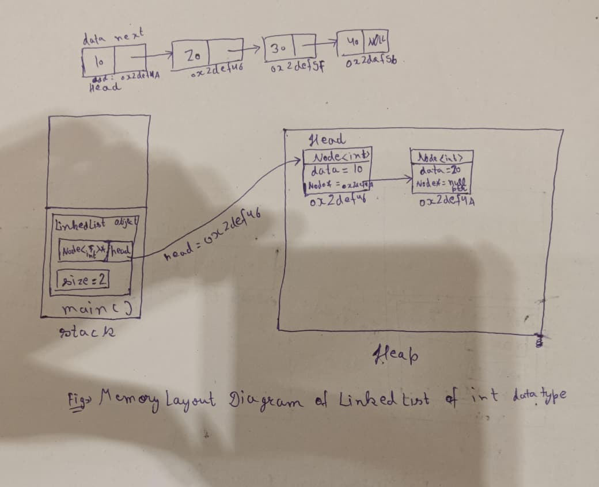

**Project Title:** Building a Data Structures Library and Redis Lite  
**Student Name:** Suman Mondal  
**Date:** 07 July 2026

# Linked List Design Proposal

This proposal describes the design and implementation of the **Linked List** data structure developed as part of the **Data Structures Library**. It explains the public interface, internal structure, complexity estimates, and key design decisions used during implementation.

The proposal is divided into four sections:

1. **Public API**
2. **Internal Structure**
3. **Complexity Estimates**
4. **Design Decisions**

A **Linked List** is a linear data structure in which elements are stored as individual **nodes**. Each node contains the actual data and a pointer to the next node in the sequence. Unlike arrays, linked list nodes are **not stored in contiguous memory locations**. Instead, they are dynamically allocated and connected through pointers.

Because nodes are allocated individually, the linked list can grow by adding new nodes and shrink by deleting existing nodes. It does not need a fixed capacity like a static array or a resizing strategy like a dynamic array.

The linked list is implemented as a **class template** using `template<typename T>`. This allows the same implementation to store values of any valid C++ type, including primitive types, Standard Library objects, and user-defined classes.

---

# Section 1: Public API

The **Public API** defines the functions available to the user of the `LinkedList` class. It includes insertion, deletion, access, search, traversal, and size-related operations.

The purpose of this API is to make the linked list:

- Simple to use
- Reusable for different data types
- Safe against invalid operations
- Consistent with common data structure interfaces
- Easy to maintain and extend

## Class Structure

```cpp
template<typename T>
class Node {
public:
    T data;
    Node<T>* next;
};

template<typename T>
class LinkedList {
private:
    Node<T>* head;
    int size;

public:
    LinkedList();
    ~LinkedList();
    LinkedList(const LinkedList& other);
    LinkedList& operator=(const LinkedList& other);

    void push_front(T val);
    void push_back(T val);
    void pop_front();
    void pop_back();
    void insertAtIndex(int index, T val);
    void deleteAtIndex(int index);
    T& get(int index);
    int search(T val);
    void traverse();
    int getSize();
};
```

The function `get()` returns `T&` so that the caller can access the original stored value directly instead of receiving only a copy.

---

## `push_front(T val)`

The `push_front(T val)` function inserts a new node at the **beginning** of the linked list.

The function allocates memory for a new node. If raw memory is allocated using `malloc()`, placement `new` is used to construct the node or its stored object correctly. The new node's `next` pointer is set to the current head, and then the head pointer is updated to point to the new node.

If the list is empty, the new node automatically becomes the first node. Finally, `size` is incremented.

### Parameter

- **`T val`**: The value used to initialize the new node.

### Return Type

- **`void`**: The function does not return a value.

### Exception Conditions

- Throws **`std::bad_alloc`** if memory allocation fails.

### Time Complexity

- **Best Case:** `O(1)`
- **Average Case:** `O(1)`
- **Worst Case:** `O(1)`

---

## `push_back(T val)`

The `push_back(T val)` function inserts a new node at the **end** of the linked list.

The function first creates a new node. If the list is empty, the new node becomes the head. Otherwise, the function traverses the list until the last node is reached, then updates the last node's `next` pointer to point to the new node.

Finally, `size` is incremented.

### Parameter

- **`T val`**: The value used to initialize the new node.

### Return Type

- **`void`**: The function appends a new node to the list.

### Exception Conditions

- Throws **`std::bad_alloc`** if memory allocation fails.

### Time Complexity

- **Best Case:** `O(1)` when the list is empty
- **Average Case:** `O(n)`
- **Worst Case:** `O(n)`

Here, **`n`** represents the number of nodes in the linked list.

---

## `pop_front()`

The `pop_front()` function removes the first node from the linked list.

If the list is empty, the function throws an exception because no node is available for deletion. Otherwise, a temporary pointer stores the current head node, and the head pointer is updated to the next node.

Before releasing memory, the stored object is destroyed correctly. If placement `new` was used during construction, the destructor must be called explicitly before releasing the raw memory using `free()`. Finally, `size` is decremented.

### Parameter

- **None**

### Return Type

- **`void`**: The function removes the first node.

### Exception Conditions

- Throws **`std::underflow_error`** if deletion is attempted on an empty list.

### Time Complexity

- **Best Case:** `O(1)`
- **Average Case:** `O(1)`
- **Worst Case:** `O(1)`

---

## `pop_back()`

The `pop_back()` function removes the last node from the linked list.

If the list is empty, the function throws an exception. If the list contains only one node, that node is destroyed and freed, `head` is set to `nullptr`, and `size` is decremented.

If the list contains more than one node, the function traverses the list until it reaches the second-last node. The last node is then destroyed, its memory is released, and the second-last node's `next` pointer is set to `nullptr`.

### Parameter

- **None**

### Return Type

- **`void`**: The function removes the last node.

### Exception Conditions

- Throws **`std::underflow_error`** if deletion is attempted on an empty list.

### Time Complexity

- **Best Case:** `O(1)` when the list contains one node
- **Average Case:** `O(n)`
- **Worst Case:** `O(n)`

Here, **`n`** represents the number of nodes in the linked list.

---

## `insertAtIndex(int index, T val)`

The `insertAtIndex(int index, T val)` function inserts a new node at the specified index.

First, the function validates the index. A valid insertion index lies between `0` and `size`, inclusive. If `index == 0`, the function can call `push_front(val)`. If `index == size`, the function can call `push_back(val)`. This avoids duplicate insertion logic and improves maintainability.

For indexes between `1` and `size - 1`, the function traverses the list until it reaches the node immediately before the insertion position. The new node is then linked by updating pointers in the correct order: first the new node points to the next node, then the previous node points to the new node.

### Parameters

- **`int index`**: The position where the new node will be inserted.
- **`T val`**: The value used to initialize the new node.

### Return Type

- **`void`**: The function inserts a new node at the specified index.

### Exception Conditions

- Throws **`std::out_of_range`** if `index < 0` or `index > size`.
- Throws **`std::bad_alloc`** if memory allocation fails.

### Time Complexity

- **Best Case:** `O(1)` when inserting at the beginning
- **Average Case:** `O(n)`
- **Worst Case:** `O(n)`

Here, **`n`** represents the number of nodes in the linked list.

---

## `deleteAtIndex(int index)`

The `deleteAtIndex(int index)` function removes the node stored at the specified index.

First, the function checks whether the index is valid. A valid deletion index lies between `0` and `size - 1`. If `index == 0`, the function can call `pop_front()`. If `index == size - 1`, the function can call `pop_back()`. This reuses existing deletion logic for boundary cases.

For other valid indexes, the function traverses the list until it reaches the node immediately before the target node. The previous node is linked directly to the node after the target node, excluding the target node from the list. The removed node is then destroyed and its memory is released.

### Parameter

- **`int index`**: The position of the node to be removed.

### Return Type

- **`void`**: The function removes the node at the specified index.

### Exception Conditions

- Throws **`std::out_of_range`** if `index < 0` or `index >= size`.
- Throws **`std::underflow_error`** if deletion is attempted on an empty list.

### Time Complexity

- **Best Case:** `O(1)` when deleting the first node
- **Average Case:** `O(n)`
- **Worst Case:** `O(n)`

Here, **`n`** represents the number of nodes in the linked list.

---

## `T& get(int index)`

The `get(int index)` function returns the element stored at the specified index.

Unlike arrays, linked lists do not support direct address calculation using an index. Therefore, the function must traverse the list from the head until the required node is reached.

The function returns a reference (`T&`) instead of a copy. This avoids unnecessary copying and allows the caller to modify the original stored element if required.

### Parameter

- **`int index`**: The position of the element to access.

### Return Type

- **`T&`**: A reference to the element stored at the specified index.

### Exception Conditions

- Throws **`std::out_of_range`** if `index < 0` or `index >= size`.

### Time Complexity

- **Best Case:** `O(1)` when accessing the first node
- **Average Case:** `O(n)`
- **Worst Case:** `O(n)`

Here, **`n`** represents the number of nodes in the linked list.

---

## `int search(T val)`

The `search(T val)` function searches for a specified value in the linked list.

The search starts from the head node and checks each node sequentially. Each stored value is compared with the supplied value using the equality operator (`==`). If a match is found, the function returns the index of the first matching node. If no match is found, it returns `-1`.

### Parameter

- **`T val`**: The value to search for.

### Return Type

- **`int`**: The index of the first matching value, or `-1` if the value is not found.

### Time Complexity

- **Best Case:** `O(1)` when the value is stored at the head node
- **Average Case:** `O(n)`
- **Worst Case:** `O(n)`

Here, **`n`** represents the number of nodes in the linked list.

---

## `void traverse()`

The `traverse()` function visits every node in the linked list and displays each stored element.

Traversal starts from the head and continues by following `next` pointers until the end of the list is reached. The function does not modify the linked list.

### Parameter

- **None**

### Return Type

- **`void`**: The function displays all elements and does not return a value.

### Time Complexity

- **Best Case:** `O(n)`
- **Average Case:** `O(n)`
- **Worst Case:** `O(n)`

Here, **`n`** represents the number of nodes in the linked list.

---

## `int getSize()`

The `getSize()` function returns the current number of nodes in the linked list.

Since the class maintains a separate `size` variable, this function returns that value directly without traversing the list.

### Parameter

- **None**

### Return Type

- **`int`**: The current number of nodes in the linked list.

### Time Complexity

- **Best Case:** `O(1)`
- **Average Case:** `O(1)`
- **Worst Case:** `O(1)`

---

# Section 2: Internal Structure

The **Internal Structure** section explains how the `LinkedList` class is implemented internally and how memory is organized during execution.

The linked list is implemented using two class templates:

- **`Node<T>`**: Represents an individual node.
- **`LinkedList<T>`**: Manages the collection of nodes and provides the public interface.

Each node contains:

- A data member of type `T`, which stores the actual value.
- A pointer named `next`, which stores the address of the next node.

The `LinkedList` class maintains:

- **`Node<T>* head`**: Points to the first node of the linked list.
- **`int size`**: Stores the current number of nodes.

Initially, `head` is set to `nullptr`, which means the list is empty. When a new node is inserted, memory is allocated dynamically. Since nodes are allocated independently, linked list elements are not stored in contiguous memory locations.

During deletion, the target node is disconnected from the list, its stored object is destroyed correctly, and its memory is released. Unlike a Dynamic Array, the linked list does not have a capacity variable and does not require a shrinking strategy. Deleting a node directly frees that node's memory.

## Memory Layout


## Template Concept and Generic Type

The linked list is implemented using `template<typename T>`. Here, `T` is a placeholder for the actual data type that will be used when an object is created.

For example:

```cpp
LinkedList<int> numbers;
LinkedList<double> prices;
LinkedList<std::string> names;
```

This is called **generic programming**. It avoids writing separate linked list classes for different data types. The same code can work with primitive types, Standard Library types, and user-defined classes.

The type `T` is resolved at compile time, so the implementation remains type-safe while still being reusable.

## Object-Oriented Programming Principles Used

The implementation uses the following OOP principles:

- **Encapsulation:** `head` and `size` are private, so users cannot directly modify the internal state.
- **Abstraction:** Users call functions such as `push_front()`, `insertAtIndex()`, and `deleteAtIndex()` without needing to manage pointers manually.
- **Modularity:** Each operation is implemented as a separate member function with a clear responsibility.
- **Code Reuse:** `insertAtIndex()` can reuse `push_front()` and `push_back()` for boundary insertions. `deleteAtIndex()` can reuse `pop_front()` and `pop_back()` for boundary deletions.

Inheritance and polymorphism are not required because this data structure mainly focuses on efficient node management and a clean container interface.

## Rule of Three

Since the linked list manages dynamically allocated memory, it follows the **Rule of Three**:

1. **Destructor**
2. **Copy Constructor**
3. **Copy Assignment Operator**

### Destructor

The destructor traverses the entire list, destroys each node, and releases its memory. This prevents memory leaks when the linked list object goes out of scope.

### Copy Constructor

The copy constructor performs a **deep copy** of the source list. Instead of copying node addresses, it creates new nodes for every element. As a result, both linked lists own independent memory.

### Copy Assignment Operator

The copy assignment operator first releases the memory currently owned by the destination list. It then performs a deep copy of the source list. It should also handle self-assignment safely. This prevents shallow copying, dangling pointers, memory leaks, and double deletion.

---
